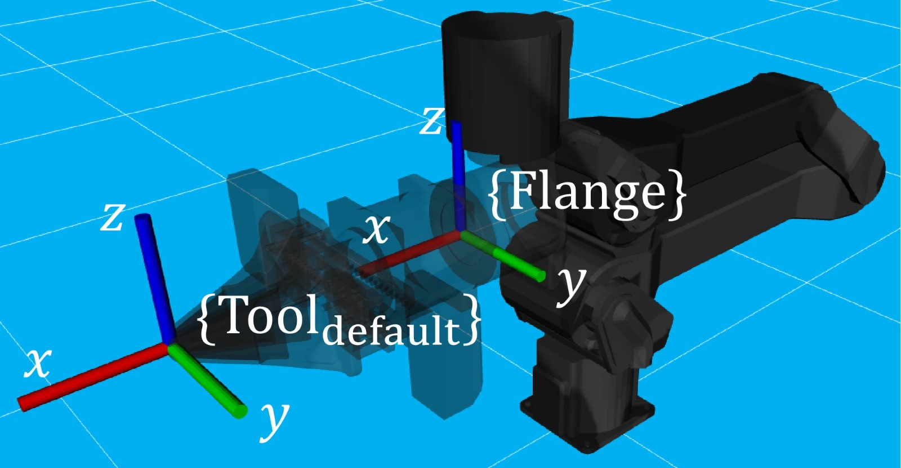

=============
Configuration
=============

This section walks you through the configurations that can be set on a Trossen AI arm.
Properly configuring the arm for your application is crucial to ensure the arm operates as expected.

What You Need
=============

To get started, please make sure you have gone through the :doc:`software_setup`.

Overview
========

Depending on

- when the change takes effect
- whether the changed configuration is reset to default at the next boot

the configurations are divided into four categories as given in the following table.

.. list-table::
    :width: 100%
    :class: borderless
    :align: center
    :header-rows: 1
    :stub-columns: 1

    *   -
        -   Immediately Applied
        -   Applied at Next Boot
    *   -   Remain Unchanged After Reboot
        -   -   :ref:`getting_started/configuration:joint characteristics`
        -   -   :ref:`getting_started/configuration:ip_method`
            -   :ref:`getting_started/configuration:manual_ip, dns, gateway, subnet`
    *   -   Reset to Default After Reboot
        -   -   :ref:`getting_started/configuration:end effector`
            -   :ref:`getting_started/configuration:joint modes`
            -   :ref:`getting_started/configuration:joint limits`
            -   :ref:`getting_started/configuration:motor parameters`
            -   :ref:`getting_started/configuration:algorithm parameter`
        -   -   :ref:`getting_started/configuration:factory_reset_flag`

The driver provides methods to get and set these configurations.
An example of a configuration script is given here.

.. tabs::

    .. code-tab:: c++

        // Include the header files
        #include "libtrossen_arm/trossen_arm.hpp"

        int main(int argc, char** argv)
        {
          // Create a driver object
          trossen_arm::TrossenArmDriver driver;

          // Configure the driver
          // This configuration is mandatory, including
          // - model of the arm
          // - end effector properties
          // - IP address of the arm
          // - whether to clear the existing error state if any
          // - Timeout for connection to the arm controller's TCP server in seconds
          driver.configure(...);

          // Get/set some configurations if needed
          // Here xxx can be
          // - factory_reset_flag
          // - ip_method
          // - manual_ip
          // - dns
          // - gateway
          // - subnet
          // - joint_characteristics
          // - effort_corrections
          // - friction_transition_velocities
          // - friction_constant_terms
          // - friction_coulomb_coefs
          // - friction_viscous_coefs
          // - end_effector
          // - joint_modes
          // - joint_limits
          // - motor_parameters
          // - algorithm_parameter
          auto xxx = driver.get_xxx(...);
          driver.set_xxx(...);
        }

    .. code-tab:: py

        # Import the driver
        import trossen_arm

        if __name__ == "__main__":
            # Create a driver object
            driver = trossen_arm.TrossenArmDriver()

            # Configure the driver
            # This configuration is mandatory, including
            # - model of the arm
            # - end effector properties
            # - IP address of the arm
            # - whether to clear the existing error state if any
            # - Timeout for connection to the arm controller's TCP server in seconds
            driver.configure(...)

            # Get/set some configurations if needed
            # Here xxx can be
            # - factory_reset_flag
            # - ip_method
            # - manual_ip
            # - dns
            # - gateway
            # - subnet
            # - joint_characteristics
            # - effort_corrections
            # - friction_transition_velocities
            # - friction_constant_terms
            # - friction_coulomb_coefs
            # - friction_viscous_coefs
            # - end_effector
            # - joint_modes
            # - joint_limits
            # - motor_parameters
            # - algorithm_parameter
            xxx = driver.get_xxx(...)
            driver.set_xxx(...)

.. tip::

    We provide methods to exchange persistent configurations via a YAML file.
    Check out the :ref:`getting_started/demo_scripts:`configuration_in_yaml`_` demo for more details.

Default Values
==============

The default values are given in `default_configurations_wxai_v0.yaml`_.

.. _`default_configurations_wxai_v0.yaml`: https://github.com/TrossenRobotics/trossen_arm/blob/main/demos/python/default_configurations_wxai_v0.yaml

.. note:: The default value of the :ref:`getting_started/configuration:joint characteristics` is calibrated at manufacturing and different for each arm.

How They Work?
==============

Here is a breakdown of how the configurations affect the behavior of the arm.

.. contents::
    :local:
    :depth: 2

factory_reset_flag
------------------

If the ``factory_reset_flag`` is set to true, all configurations are reset to their factory default values at the next boot.

Choices: ``bool``

Ethernet Configuration
----------------------

At startup, the arm controller tries to connect to the network.
The procedure is as follows.

.. mermaid::
    :align: center

    flowchart LR
        A(Power on) --> B{ip_method?}
        B -->|dhcp| C(Acquire IP from DHCP server)
        B -->|manual| D(Set up ethernet according to the configurations)
        C --> E{success?}
        E -->|yes| F(Set up ethernet as DHCP server directs)
        E -->|no| D

ip_method
^^^^^^^^^

The IP method specifies whether the arm controller acquires its IP address from a DHCP server or uses a static IP address.

Choices: :enum:`trossen_arm::IPMethod`

.. note::

    If the IP method is set to :enumerator:`trossen_arm::IPMethod::dhcp`, we expect a DHCP server to be present in the network.
    It can be a router or a computer with a DHCP server running.

manual_ip, dns, gateway, subnet
^^^^^^^^^^^^^^^^^^^^^^^^^^^^^^^

If the IP method is set to :enumerator:`trossen_arm::IPMethod::manual`, the manual IP address, DNS, gateway, and subnet are used.

Ranges: valid IPv4 addresses as strings

Joint Characteristics
---------------------

The joint characteristics affect the behavior of each joint.

effort_corrections
^^^^^^^^^^^^^^^^^^

The :member:`trossen_arm::JointCharacteristic::effort_correction` maps a motor's effort unit to the standard unit, i.e., Nm and N.

To give an example, in external effort mode, the command sent to the motor is given by the following expression.

.. math::

    \text{effort}_\text{motor} = \text{effort_correction} \times \left( \text{external_effort}_\text{desired} + \text{effort}_\text{compensation} \right)

Vice versa, the effort returned by the driver is given by the following expression.

.. math::

    \text{external_effort} = \frac{\text{effort}_\text{motor}}{\text{effort_correction}} - \text{effort}_\text{compensation}

Range: :math:`[0.2, 5.0]`

friction_transition_velocities, friction_constant_terms, friction_coulomb_coefs, and friction_viscous_coefs
^^^^^^^^^^^^^^^^^^^^^^^^^^^^^^^^^^^^^^^^^^^^^^^^^^^^^^^^^^^^^^^^^^^^^^^^^^^^^^^^^^^^^^^^^^^^^^^^^^^^^^^^^^^

We model joint friction as a function of velocity and effort of three components: Coulomb, viscous, and constant.

- The Coulomb friction is proportional to the magnitude of the effort.
- The viscous friction is proportional to the velocity.
- The constant friction is independent of the velocity and effort.

To deal with the discontinuity when the direction of the velocity changes, we use a linear transition characterized by the transition velocity.

The resulting compensation effort is given below, where :math:`\text{effort}_\text{inverse_dynamics}` is the effort computed by inverse dynamics.

.. math::

    \text{effort}_\text{friction} &= \text{constant_term} \\
    &+ \text{coulomb_coef} \times \lvert \text{effort}_\text{inverse_dynamics} \rvert \\
    &+ \text{viscous_coef} \times \lvert \text{velocity} \rvert \\
    \text{effort}_\text{compensation} &= \text{effort}_\text{inverse_dynamics} \\
    &+ \begin{cases}
        + \text{effort}_\text{friction} & \text{if } \text{velocity} \gt \text{transition_velocity} \\
        - \text{effort}_\text{friction} & \text{if } \text{velocity} \lt -\text{transition_velocity} \\
        + \text{effort}_\text{friction} \times \frac{\text{velocity}}{\text{transition_velocity}} & \text{otherwise}
    \end{cases}

Each controller-arm pair comes with calibrated effort corrections and friction parameters as defaults.
They should work decently for most applications.
However, you can always fine-tune them according to personal preferences.

Here is a guideline to tune the effort corrections and friction parameters.

1.  Put the arm in gravity compensation, i.e., all external efforts are zero
2.  Tune the joints one by one from gripper to base

    -   Increase :member:`trossen_arm::JointCharacteristic::effort_correction` if the links onwards are pulled down by gravity
    -   Move the joint at low velocity and increase the :member:`trossen_arm::JointCharacteristic::friction_coulomb_coef` if the resistance is stronger when the joint is compensating for gravity than in a balanced position
    -   Move the joint at varying velocities and increase the :member:`trossen_arm::JointCharacteristic::friction_viscous_coef` if there's more resistance at higher velocity
    -   Increase the :member:`trossen_arm::JointCharacteristic::friction_constant_term` to uniformly reduce the resistance up til the joint starts moving spontaneously
    -   Increase the :member:`trossen_arm::JointCharacteristic::friction_transition_velocity` if quiet operation and large stiction is preferred over reduced stiction with high-frequency oscillations

Ranges:

-    :member:`trossen_arm::JointCharacteristic::friction_transition_velocity`: :math:`\mathbb{R}_{\gt 0}`
-    others: :math:`\mathbb{R}`

position_offset
^^^^^^^^^^^^^^^

The :member:`trossen_arm::JointCharacteristic::position_offset` offsets the joint position to account for homing error.
It is added to the command sent to the motor and subtracted from the feedback received from the motor.

:math:`\text{position}_\text{motor} = \text{position} + \text{position_offset}`

where :math:`\text{position}_\text{motor}` is used by the motor and :math:`\text{position}` is intended to match the kinematic model definition.

All transactions of positions in the driver API refer to :math:`\text{position}`, e.g., :member:`trossen_arm::RobotOutput::Cartesian::positions`, :member:`trossen_arm::RobotOutput::Joint::All::positions`, :func:`trossen_arm::TrossenArmDriver::set_cartesian_positions`, and :func:`trossen_arm::TrossenArmDriver::set_all_positions`.

Range: :math:`\mathbb{R}`

.. warning::

    Since these configurations are arm specific, mixed usage of controller and arm with different serial numbers may cause deterioration in performance.

End Effector
------------

The :class:`trossen_arm::EndEffector` allow the usage of different end effectors.
It's important to match the end effector properties with the actual end effector attached to the arm.
Otherwise, the controller won't be able to properly compensate for the end effector's weight and inertia.

.. tip::

    End effector variants supported by Trossen Robotics are provided in :class:`trossen_arm::StandardEndEffector`.

.. tip::

    New in version :ref:`changelog:1.8.3`: the original rack-and-pinion end effector can be removed or replaced with a custom end effector.

    On startup, the controller checks if the gripper motor exists.
    If the motor is not detected, it assumes that the gripper assembly has been removed.
    An example with nothing mounted at the flange is given by :member:`trossen_arm::StandardEndEffector::no_gripper`.

    What works:

    -   Inverse dynamics for the arm joints, e.g., gravity and friction compensations
    -   Input and output of the arm joints, e.g., Cartesian and joint positions, velocities, and efforts

    What won't work:

    -   Input and output of the end effector

Link Properties
^^^^^^^^^^^^^^^

The :class:`trossen_arm::Link` members of the end effector define the three links of an end effector.

- :member:`trossen_arm::EndEffector::palm`: the whole end effector excluding the fingers
- :member:`trossen_arm::EndEffector::finger_left`: the finger on the left side
- :member:`trossen_arm::EndEffector::finger_right`: the finger on the right side

The definition of :class:`trossen_arm::Link` follows the `URDF convention <https://wiki.ros.org/urdf/XML/link>`_.
And the left and right sides are defined with respect to the arm's perspective, i.e., observing from the base to the end effector when the joints are in home positions.

A custom end effector should be treated as a single link defined by :member:`trossen_arm::EndEffector::palm`.
The finger links are ignored in this case.

Ranges:

-   :member:`trossen_arm::Link::mass`: :math:`\mathbb{R}`
-   :member:`trossen_arm::Link::inertia`: :math:`\mathbb{R}^9`
-   :member:`trossen_arm::Link::origin_xyz`: :math:`\mathbb{R}^3`
-   :member:`trossen_arm::Link::origin_rpy`: :math:`\mathbb{R}^3`

Finger Offsets
^^^^^^^^^^^^^^

The offsets of the left and right fingers define the home position specific to the fingers.

- :member:`trossen_arm::EndEffector::offset_finger_left`: the offset from the palm center to the left carriage center in m with the fingers closed
- :member:`trossen_arm::EndEffector::offset_finger_right`: the offset from the palm center to the right carriage center in m with the fingers closed

For a custom end effector, these offsets are ignored.

Ranges: :math:`\mathbb{R}`

pitch_circle_radius
^^^^^^^^^^^^^^^^^^^

The pitch circle radius defines the transmission ratio of the rack and pinion mechanism of the original end effector.

:member:`trossen_arm::EndEffector::pitch_circle_radius` specifies pitch circle radius of the pinion of the end effector.

For a custom end effector, this value is ignored.

Range: :math:`\mathbb{R}`

t_flange_tool
^^^^^^^^^^^^^

:member:`trossen_arm::EndEffector::t_flange_tool` defines the tool frame pose measured in the flange frame as shown in the image below.

.. note::

    The first 3 elements are the translation and the last 3 elements are the angle-axis representation of the rotation

Range: :math:`\mathbb{R}^6`

Joint Modes
-----------

The joint modes define the mode of operation of each joint.

Choices: :enum:`trossen_arm::Mode`

Joint Limits
------------

The joint limits define the operating limits of each joint.

The block diagram of the control loop of the motor is given below.

.. mermaid::
    :align: center

    flowchart TD
        A[ ] -->|desired position| B[clip]
        style A fill:transparent, stroke:transparent
        B -->|clipped desired position| C((sum))
        C -->|position error| D[PID]
        D -->|desired velocity| E((sum))
        E --> F[clip]
        F -->|clipped desired velocity| G((sum))
        G -->|velocity error| H[PID]
        H -->|desired effort| I((sum))
        I --> J[clip]
        J -->|clipped desired effort| K((motor))

        L[ ] -->|feedforward velocity| E
        style L fill:transparent, stroke:transparent
        M[ ] -->|feedforward effort| I
        style M fill:transparent, stroke:transparent

        K -->|actual position| N{check}
        N -->|within limit| C
        K -->|actual velocity| O{check}
        O -->|within limit| G

        N -->|beyond limit| P[error]
        O -->|beyond limit| P

When the controller receives a command from the driver, it generates the command for a motor by clipping to the min and max limits.

-   position = min(max(position, :member:`trossen_arm::JointLimit::position_min`), :member:`trossen_arm::JointLimit::position_max`)
-   velocity = min(velocity, :member:`trossen_arm::JointLimit::velocity_max`)
-   effort = min(effort, :member:`trossen_arm::JointLimit::effort_max`)

When the controller receives a feedback from the motor, it triggers an error if anything is beyond the max and min limits padded by the tolerances.

-   position < :member:`trossen_arm::JointLimit::position_max` + :member:`trossen_arm::JointLimit::position_tolerance`
-   position > :member:`trossen_arm::JointLimit::position_min` - :member:`trossen_arm::JointLimit::position_tolerance`
-   velocity < :member:`trossen_arm::JointLimit::velocity_max` + :member:`trossen_arm::JointLimit::velocity_tolerance`
-   effort < :member:`trossen_arm::JointLimit::effort_max` + :member:`trossen_arm::JointLimit::effort_tolerance`

For reference, we can choose the limits as follows.

#.  When creating a new application script, we need

    -   the min and max limits to be above the expected motion range
    -   the tolerances to be 0.0 to catch any unexpected behavior

#.  When the application script is well tested, we need

    -   the min and max limits to be above the expected motion range
    -   the tolerances to be some positive values to avoid false positives

Range: :math:`\mathbb{R}`

Motor Parameters
----------------

The motor parameters define the control parameters of each motor.

As shown in the block diagram above, each motor :class:`trossen_arm::MotorParameter` has two PID controllers for position and velocity regulation.
By setting different parameters in :class:`trossen_arm::PIDParameter`, we can achieve the behavior of different :enum:`trossen_arm::Mode`.

Ranges: :math:`\mathbb{R}`

Algorithm Parameter
-------------------

This configuration defines the parameters used for robotic algorithms.

-   :member:`trossen_arm::AlgorithmParameter::singularity_threshold`:

    When moving in Cartesian space, an error is triggered if the arm is close to a singular configuration.
    The threshold is defined below.

    .. math::

        \text{singularity_threshold} \lt \frac{\min_i {|\text{pivot}_i|}}{\max_i {|\text{pivot}_i|}}

    where :math:`\text{pivot}_i` is the :math:`i`'th pivot of the QR decomposition of the Jacobian that maps joint velocities to Cartesian velocities.

    Range: :math:`\mathbb{R}`

What's Next?
============

Now that the arm is configured, an assorted collection of :doc:`/getting_started/demo_scripts` is available to help you get started with controlling the arm.
