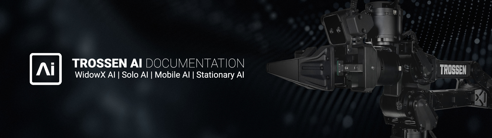

=========================
Trossen Arm Documentation
=========================

.. note::

    The libtrossen_arm C++ library and trossen_arm Python package are under heavy development.
    The API is subject to frequent changes and may not be stable.
    We advise pinning your dependencies to a specific version to avoid breaking changes and referring to the latest documentation for updates.

Documentation for the Trossen Arm hardware and software, including setup guides, integrations, and API references.

What's Here
===========

*   :doc:`specifications` - Contains specification information for the Trossen Arms and related hardware.
*   :doc:`getting_started` - These guides will walk you through the setup process for your Trossen Arm.
*   :doc:`tutorials` - Step-by-step guides for using the Trossen Arm with third party packages and frameworks.
*   :doc:`community` - Showcase for community highlights and integrations.
*   :doc:`downloads` - Downloadable content related to the Trossen Arm.
*   :doc:`troubleshooting` - Common issues and their solutions.
*   :doc:`service` - Information on servicing and maintaining your Trossen Arm hardware.
*   :doc:`changelog` - Changes and updates to the Trossen Arm software.
*   :doc:`api/library_root` - Trossen Arm API documentation.

Table of Contents:
==================

.. toctree::
    :maxdepth: 1
    :titlesonly:

    specifications.rst
    getting_started.rst
    tutorials.rst
    community.rst
    downloads.rst
    troubleshooting.rst
    service.rst
    changelog.rst
    api/library_root
